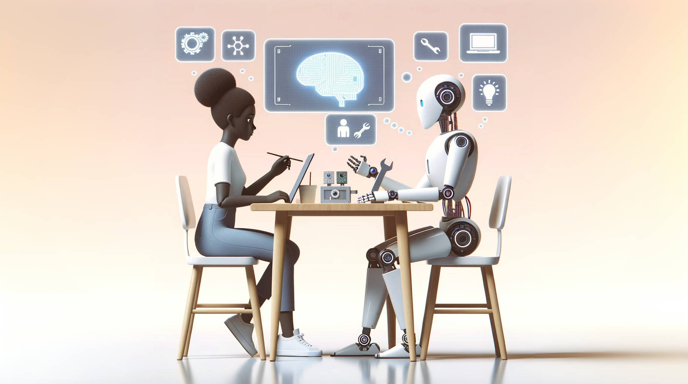

# Reading List: Recent Advances in Machine Theory of Mind



This illustration is generated using DALL·E 3

## Overview

### Citation

This is a curated list of related literature and resources for machine theory of mind (ToM) research.  
**Last Update:** 21st Oct, 2023.

If you find our work useful, please give us credit by citing:

```bibtex
@inproceedings{ma2023towards,
  title={Towards A Holistic Landscape of Situated Theory of Mind in Large Language Models},
  author={Ma, Ziqiao and Sansom, Jacob and Peng, Run and Chai, Joyce},
  booktitle={Findings of the Association for Computational Linguistics: EMNLP 2023},
  year={2023}
}
```

### Contributors

- **Main Contributors:** [Martin Ziqiao Ma](http://ziqiaoma.com/)
- **Active Contributors:** [Jacob Sansom](https://jhsansom.github.io/), [Run Peng](https://sites.google.com/view/run-peng/home), [Pony Zhang](https://www.ponyzhang.me/)

### How To Contribute

Welcome to be a collaborator! 
- To add missing papers: Please create an issue or pull request, so the team can make the update.
- To become a contributor: Please drop a email to [Martin](mailto:marstin@umich.edu).

## Table of Contents

- [1. ToM Community Resources](#1-tom-community-resources)
   * [1.1 Workshops](#11-workshops)
   * [1.2 Talks and Tutorials](#12-talks-and-tutorials)
   * [1.3 Tools](#13-tools)
- [2. Machine ToM Surveys and Position Papers](#2-machine-tom-surveys-and-position-papers)
- [3. Cognitive Underpinnings of ToM](#3-cognitive-underpinnings-of-tom)
   * [3.1 Definition and Importance of ToM in Human Cognition (Selected)](#31-definition-and-importance-of-tom-in-human-cognition-selected)
   * [3.2 Taxonomies of ToM and Mental States](#32-taxonomies-of-tom-and-mental-states)
- [4. Computational Inquiry to ToM in Foundation Models](#4-computational-inquiry-to-tom-in-foundation-models)
   * [4.1 Probing Intrinsic Mental States](#41-probing-intrinsic-mental-states)
   * [4.1 Evidence for Understanding Extrinsic Mental States](#41-evidence-for-understanding-extrinsic-mental-states)
   * [4.2 Counter-Evidence for Understanding Extrinsic Mental States](#42-counter-evidence-for-understanding-extrinsic-mental-states)
- [4. ToM Benchmarks and Platforms ](#4-tom-benchmarks-and-platforms)
- [5. Computational Modeling of ToM](#5-computational-modeling-of-tom)
   * [5.1 Learning Latent Representation for ToM](#51-learning-latent-representation-for-tom)
   * [5.2 Learning (Neural-)Symbolic Representation for ToM](#52-learning-neural-symbolic-representation-for-tom)
   * [5.3 Prompting and In-Context Learning for ToM in LLMs](#53-prompting-and-in-context-learning-for-tom-in-llms)
   * [5.4 Bayesian and (Inverse) Reinforcement Learning Based ToM Modeling](#54-bayesian-and-inverse-reinforcement-learning-based-tom-modeling)
   * [5.5 Other ToM Modeling](#55-other-tom-modeling)
- [6. ToM Application](#6-tom-application)
   * [6.1 Pragmatics and Instruction Generation/Following](#61-pragmatics-and-instruction-generationfollowing)
   * [6.2 Dialogue Processing and Generation](#62-dialogue-processing-and-generation)
   * [6.3 Language Acquisition](#63-language-acquisition)
   * [6.4 Human-AI Interactions](#64-human-ai-interactions)
   * [6.5 Explainable AI](#65-explainable-ai)
   * [6.6 Healthcare](#66-healthcare)

## 1. ToM Community Resources

### 1.1 Workshops

- (ToM 2024) 2nd Workshop on Theory-of-Mind @ ICLR 2024. [**[Web]**](https://tomworkshop.github.io/)
- (ToM 2023) 1st Workshop on Theory-of-Mind @ ICML 2023. [**[Web]**](https://tomworkshop.github.io/)

### 1.2 Talks and Tutorials

- To be updated

### 1.3 Tools

- (ToM 2023) The SocialAI School: Insights from Developmental Psychology Towards Artificial Socio-Cultural Agents. [**[Web]**](https://sites.google.com/view/socialai-school)

## 2. Machine ToM Surveys and Position Papers

- (EMNLP Findings 2023) Towards A Holistic Landscape of Situated Theory of Mind in Large Language Models.  [**[Paper]**](https://arxiv.org/abs/2310.19619)
- (Preprint 2023) A Review on Machine Theory of Mind. [**[Paper]**](https://arxiv.org/abs/2303.11594)
- (EMNLP Findings 2022) Language Models as Agent Models. [**[Paper]**](https://arxiv.org/abs/2212.01681)
- (RO-MAN 2022) Understanding Intention for Machine Theory of Mind: A Position Paper. [**[Paper]**](https://dl.acm.org/doi/abs/10.1109/RO-MAN53752.2022.9900783)
- (Psychological Medicine 2020) Knowing Me, Knowing you: Theory of Mind in AI. [**[Paper]**](https://www.cambridge.org/core/journals/psychological-medicine/article/knowing-me-knowing-you-theory-of-mind-in-ai/C935A66A018117BA5B1991071393655F)
- (Neuropsychologia 2020) Theory of Mind and Decision Science: Towards a Typology of Tasks and Computational Models. [**[Paper]**](https://www.sciencedirect.com/science/article/pii/S0028393220301597)
- (AI 2018) Autonomous Agents Modelling Other Agents: A Comprehensive Survey and Open Problems. [**[Paper]**](https://arxiv.org/abs/1709.08071)
- (Preprint 2017) It Takes Two to Tango: Towards Theory of AI's Mind. [**[Paper]**](https://arxiv.org/abs/1704.00717)
- (AI 2016) Integrating Social Power Into The Decision-making of Cognitive Agents. [**[Paper]**](https://www.sciencedirect.com/science/article/pii/S0004370216300868)

## 3. Cognitive Underpinnings of ToM

### 3.1 Definition and Importance of ToM in Human Cognition (Selected)

- (Premack et al., 1978) Does the Chimpanzee Have a Theory of Mind? [**[Paper]**](https://www.cambridge.org/core/journals/behavioral-and-brain-sciences/article/doesthe-chimpanzee-have-a-theory-of-mind/1E96B02CD9850016B7C93BC6D2FEF1D0)
- (Dennett, 1988) Précis of The Intentional Stance. [**[Paper]**](https://www.cambridge.org/core/journals/behavioral-and-brain-sciences/article/precis-of-the-intentional-stance/7F329FF3E07BFEC4A62154B4E94C01A4)
- (Gopnik et al., 1992) Why the Child's Theory of Mind Really Is a Theory. [**[Paper]**](https://www.cambridge.org/core/journals/behavioral-and-brain-sciences/article/doesthe-chimpanzee-have-a-theory-of-mind/1E96B02CD9850016B7C93BC6D2FEF1D0)
- (Baron-Cohen, 1992) Mindblindness: An Essay on Autism and Theory of Mind. [**[Book]**](https://mitpress.mit.edu/9780262522250/mindblindness/)
- (Blakemore et al,. 2001) From the Perception of Action to the Understanding of Intention. [**[Paper]**](https://www.nature.com/articles/35086023)
- (Ho et al,. 2022) Planning With Theory Of Mind. [**[Paper]**](https://www.cell.com/trends/cognitive-sciences/fulltext/S1364-6613(22)00185-1)

### 3.2 Taxonomies of ToM and Mental States

- (ToM 2023) EPITOME: Experimental Protocol Inventory for Theory Of Mind Evaluation. [**[Paper]**](https://openreview.net/forum?id=e5Yky8Fnvj)
- (Stack et al., 2022) Framework for a Multi-dimensional Test of Theory of Mind for Humans and AI Systems. [**[Paper]**](https://advancesincognitivesystems.github.io/acs2022/data/acs22_paper-911.pdf)
- (Osterhaus et al., 2022) Looking for the Lighthouse: A Systematic Review of Advanced Theory-of-mind Tests beyond Preschool. [**[Paper]**](https://www.researchgate.net/publication/359080853_Looking_for_the_lighthouse_A_systematic_review_of_advanced_theory-of-mind_tests_beyond_preschool)
- (Beaudoin et al., 2020) Systematic Review and Inventory of Theory of Mind Measures for Young Children. [**[Paper]**](https://pubmed.ncbi.nlm.nih.gov/32010013/)


## 4. Computational Inquiry to ToM in Foundation Models

### 4.1 Probing Intrinsic Mental States

- (EACL 2023) Methods for Measuring, Updating, and Visualizing Factual Beliefs in Language Models. [**[Paper]**](https://aclanthology.org/2023.eacl-main.199/)
- (EMNLP Findings 2021) Tiered Reasoning for Intuitive Physics: Toward Verifiable Commonsense Language Understanding. [**[Paper]**](https://aclanthology.org/2021.findings-emnlp.422/)
- (ACL 2021) Implicit Representations of Meaning in Neural Language Models. [**[Paper]**](https://aclanthology.org/2021.acl-long.143/)

### 4.1 Evidence for Understanding Extrinsic Mental States

- (Preprint 2023) Unveiling Theory of Mind in Large Language Models: A Parallel to Single Neurons in the Human Brain. [**[Paper]**](https://arxiv.org/abs/2309.01660)
- (Preprint 2023) Sparks of Artificial General Intelligence: Early experiments with GPT-4. [**[Paper]**](https://arxiv.org/abs/2303.12712)
- (Preprint 2023) Theory of Mind Might Have Spontaneously Emerged in Large Language Models. [**[Paper]**](https://arxiv.org/abs/2302.02083)
- (EMNLP Findings 2021) Effectiveness of Pre-training for Few-shot Intent Classification. [**[Paper]**](https://arxiv.org/abs/2109.05782)

### 4.2 Counter-Evidence for Understanding Extrinsic Mental States

- (Preprint 2023) Clever Hans or Neural Theory of Mind? Stress Testing Social Reasoning in Large Language Models. [**[Paper]**](https://arxiv.org/abs/2305.14763)
- (Preprint 2023) Limitation of Theory of Mind In Large Language Model: Anthropomorphize Religous Figure. [**[Paper]**](https://osf.io/preprints/psyarxiv/zu3rw/)
- (Preprint 2023) Does ChatGPT have Theory of Mind? [**[Paper]**](https://arxiv.org/abs/2305.14020)
- (Preprint 2023) Large Language Models Fail on Trivial Alterations to Theory-of-Mind Tasks. [**[Paper]**](https://arxiv.org/abs/2302.08399)
- (AI Review 2023) Mind the Gap: Challenges of Deep Learning Approaches to Theory of Mind. [**[Paper]**](https://link.springer.com/article/10.1007/s10462-023-10401-x)
- (Preprint 2022) Do Large Language Models Know what Humans Know? [**[Paper]**](https://arxiv.org/abs/2209.01515)
- (Preprint 2022) Large Language Models Are Not Zero-shot Communicators. [**[Paper]**](https://arxiv.org/abs/2210.14986)
- (EMNLP 2022) Neural Theory-of-Mind? On the Limits of Social Intelligence in Large LMs. [**[Paper]**](https://arxiv.org/abs/2210.13312)

## 4. ToM Benchmarks and Platforms 

<p>
    A taxonomized review of existing benchmarks for machine ToM and their settings under ATOMS. We further break <strong>beliefs</strong> into first-order beliefs (1st) and second-order beliefs or beyond (2nd+); and break <strong>intentions</strong> into <u>Action</u> intentions and <u>Communicative</u> intentions. <strong>Tasks</strong> are divided into <u>Inference</u>, <u>Question Answering</u>, <u>Natural Language Generation</u>, <u>MultiAgent Collaboration</u>, and <u>MultiAgent Competition</u>. <strong>Input</strong> modalities consist of <u>Text</u> (Human, AI, or Template) and <u>Nonlinguistic</u> ones. The latter further breaks into <u>Cartoon</u>, Natural <u>Images</u>, <u>Chess</u>, <u>2D Grid</u> World, and 3D <u>Simulation</u>. The <strong>Situatedness</strong> is divided into None, Passive <u>Perceiver</u>, and Active <u>Interactor</u>. <strong>Symmetricity</strong> refers to whether the tested agent is co-situated and engaged in mutual interactions with other ToM agents.
</p>
<table border="1" style="text-align: left;">
    <thead>
        <tr >
            <th rowspan="3" style="text-align: center;">Benchmarks and Task Formulations</th>
            <th colspan="3" style="text-align: center;">Tested Agent</th>
            <th colspan="4" style="text-align: center;">Situatedness</th>
            <th colspan="9" style="text-align: center;">ATOMS Mental States</th>
            <th rowspan="3" style="text-align: center;">Sym.</th>
        </tr>
        <tr style="text-align: center;">
            <th rowspan="2" style="text-align: center;">Task</th>
            <th colspan="2" style="text-align: center;">Input Modality</th>
            <th colspan="2" style="text-align: center;">Physical</th>
            <th colspan="2" style="text-align: center;">Social</th>
            <th colspan="2" style="text-align: center;">Belief</th>
            <th colspan="2" style="text-align: center;">Intention</th>
            <th rowspan="2" style="text-align: center;">Des.</th>
            <th rowspan="2" style="text-align: center;">Emo.</th>
            <th rowspan="2" style="text-align: center;">Know.</th>
            <th rowspan="2" style="text-align: center;">Per.</th>
            <th rowspan="2" style="text-align: center;">NLC</th>
        </tr>
        <tr style="text-align: center;">
            <th style="text-align: center;">Text</th>
            <th style="text-align: center;">Nonling.</th>
            <th style="text-align: center;">Per.</th>
            <th style="text-align: center;">Int.</th>
            <th style="text-align: center;">Per.</th>
            <th style="text-align: center;">Int.</th>
            <th style="text-align: center;">1st</th>
            <th style="text-align: center;">2nd+</th>
            <th style="text-align: center;">Act.</th>
            <th style="text-align: center;">Com.</th>
        </tr>
    </thead>
    <tbody>
        <!-- Example rows: -->
        <tr>
            <td>(Preprint 2021) <a href="https://philarchive.org/rec/COHERT">Epistemic Reasoning</a></td>
            <td>Infer</td>
            <td>T</td>
            <td>-</td>
            <td>-</td>
            <td>-</td>
            <td>-</td>
            <td>-</td>
            <td>✔️</td>
            <td>✔️</td>
            <td>-</td>
            <td>-</td>
            <td>-</td>
            <td>-</td>
            <td>-</td>
            <td>-</td>
            <td>-</td>
            <td>-</td>
        </tr>
        <tr>
            <td>(EMNLP 2018) <a href="https://arxiv.org/abs/1808.09352">ToMi</a></td>
            <td>QA</td>
            <td>T</td>
            <td>-</td>
            <td>✔️</td>
            <td>-</td>
            <td>-</td>
            <td>-</td>
            <td>✔️</td>
            <td>✔️</td>
            <td>-</td>
            <td>-</td>
            <td>-</td>
            <td>-</td>
            <td>-</td>
            <td>-</td>
            <td>-</td>
            <td>-</td>
        </tr>
        <tr>
            <td>(EMNLP Findings 2023) <a href="https://openreview.net/forum?id=CS62jXziqB">Hi-ToM</a></td>
            <td>QA</td>
            <td>T</td>
            <td>-</td>
            <td>✔️</td>
            <td>-</td>
            <td>-</td>
            <td>-</td>
            <td>✔️</td>
            <td>✔️</td>
            <td>-</td>
            <td>-</td>
            <td>-</td>
            <td>-</td>
            <td>-</td>
            <td>-</td>
            <td>-</td>
            <td>-</td>
        </tr>
        <tr>
            <td>(EMNLP Findings 2023) <a href="https://arxiv.org/abs/2305.03353">MindGames</a></td>
            <td>Infer</td>
            <td>T</td>
            <td>-</td>
            <td>✔️</td>
            <td>-</td>
            <td>-</td>
            <td>-</td>
            <td>✔️</td>
            <td>✔️</td>
            <td>-</td>
            <td>-</td>
            <td>-</td>
            <td>-</td>
            <td>-</td>
            <td>✔️</td>
            <td>-</td>
            <td>-</td>
        </tr>
        <tr>
            <td>(ToM 2023) <a href="https://openreview.net/forum?id=KxvXjtyuYl">Selective Encoding</a></td>
            <td>QA</td>
            <td>T</td>
            <td>-</td>
            <td>✔️</td>
            <td>-</td>
            <td>-</td>
            <td>-</td>
            <td>-</td>
            <td>-</td>
            <td>✔️</td>
            <td>-</td>
            <td>✔️</td>
            <td>-</td>
            <td>-</td>
            <td>-</td>
            <td>-</td>
            <td>-</td>
        </tr>
        <tr>
            <td>(Preprint 2023) <a href="https://arxiv.org/abs/2305.14763">Adv-CSFB</a></td>
            <td>QA</td>
            <td>H</td>
            <td>-</td>
            <td>✔️</td>
            <td>-</td>
            <td>-</td>
            <td>-</td>
            <td>✔️</td>
            <td>-</td>
            <td>-</td>
            <td>-</td>
            <td>-</td>
            <td>-</td>
            <td>-</td>
            <td>-</td>
            <td>-</td>
            <td>-</td>
        </tr>
        <tr>
            <td>(EMNLP 2010) <a href="https://aclanthology.org/D10-1074/">ConvEntail</a></td>
            <td>Infer</td>
            <td>H</td>
            <td>-</td>
            <td>-</td>
            <td>-</td>
            <td>✔️</td>
            <td>-</td>
            <td>✔️</td>
            <td>-</td>
            <td>-</td>
            <td>✔️</td>
            <td>✔️</td>
            <td>-</td>
            <td>-</td>
            <td>-</td>
            <td>-</td>
            <td>-</td>
        </tr>
        <tr>
            <td>(EMNLP 2019) <a href="https://arxiv.org/abs/1904.09728">SocialIQA</a></td>
            <td>QA</td>
            <td>H</td>
            <td>-</td>
            <td>-</td>
            <td>-</td>
            <td>✔️</td>
            <td>-</td>
            <td>-</td>
            <td>-</td>
            <td>✔️</td>
            <td>-</td>
            <td>-</td>
            <td>✔️</td>
            <td>-</td>
            <td>-</td>
            <td>-</td>
            <td>-</td>
        </tr>
        <tr>
            <td>(LREC 2022) <a href="https://aclanthology.org/2022.lrec-1.262/">BeSt</a></td>
            <td>-</td>
            <td>H</td>
            <td>-</td>
            <td>-</td>
            <td>-</td>
            <td>✔️</td>
            <td>-</td>
            <td>✔️</td>
            <td>-</td>
            <td>-</td>
            <td>-</td>
            <td>-</td>
            <td>✔️</td>
            <td>-</td>
            <td>-</td>
            <td>✔️</td>
            <td>-</td>
        </tr>
        <tr>
            <td>(ToM 2023) <a href="https://openreview.net/forum?id=hCwCfecQGd">Loophole</a></td>
            <td>NLG</td>
            <td>H</td>
            <td>-</td>
            <td>-</td>
            <td>-</td>
            <td>✔️</td>
            <td>-</td>
            <td>-</td>
            <td>-</td>
            <td>-</td>
            <td>-</td>
            <td>-</td>
            <td>-</td>
            <td>-</td>
            <td>-</td>
            <td>✔️</td>
            <td>-</td>
        </tr>
        <tr>
            <td>(ACL Findings 2023) <a href="https://aclanthology.org/2023.findings-acl.663/">FauxPas-EAI</a></td>
            <td>QA</td>
            <td>H,AI</td>
            <td>-</td>
            <td>-</td>
            <td>-</td>
            <td>✔️</td>
            <td>-</td>
            <td>✔️</td>
            <td>-</td>
            <td>-</td>
            <td>-</td>
            <td>-</td>
            <td>-</td>
            <td>-</td>
            <td>-</td>
            <td>✔️</td>
            <td>-</td>
        </tr>
            <tr>
            <td>(Preprint 2023) <a href="https://arxiv.org/abs/2305.05390">COKE</a></td>
            <td>NLG</td>
            <td>AI</td>
            <td>-</td>
            <td>-</td>
            <td>-</td>
            <td>✔️</td>
            <td>✔️</td>
            <td>-</td>
            <td>-</td>
            <td>✔️</td>
            <td>-</td>
            <td>-</td>
            <td>✔️</td>
            <td>-</td>
            <td>-</td>
            <td>-</td>
            <td>-</td>
        </tr>
        <tr>
            <td>(Preprint 2022) <a href="https://arxiv.org/abs/2211.04684">ToM-in-AMC</a></td>
            <td>Infer</td>
            <td>H</td>
            <td>-</td>
            <td>✔️</td>
            <td>-</td>
            <td>✔️</td>
            <td>-</td>
            <td>-</td>
            <td>-</td>
            <td>✔️</td>
            <td>✔️</td>
            <td>-</td>
            <td>-</td>
            <td>-</td>
            <td>-</td>
            <td>-</td>
            <td>-</td>
        </tr>
        <tr>
            <td>(ACL 2023) <a href="https://arxiv.org/abs/2212.10060">G4C</a></td>
            <td>NLG</td>
            <td>H,AI</td>
            <td>-</td>
            <td>✔️</td>
            <td>-</td>
            <td>✔️</td>
            <td>✔️</td>
            <td>-</td>
            <td>-</td>
            <td>✔️</td>
            <td>✔️</td>
            <td>-</td>
            <td>-</td>
            <td>-</td>
            <td>✔️</td>
            <td>-</td>
            <td>-</td>
        </tr>
        <tr>
            <td>(Preprint 2016) <a href="https://arxiv.org/abs/1612.01175">VisualBeliefs</a></td>
            <td>Infer</td>
            <td>-</td>
            <td>Cartoon</td>
            <td>✔️</td>
            <td>-</td>
            <td>-</td>
            <td>-</td>
            <td>✔️</td>
            <td>-</td>
            <td>-</td>
            <td>-</td>
            <td>-</td>
            <td>-</td>
            <td>-</td>
            <td>-</td>
            <td>✔️</td>
            <td>-</td>
        </tr>
        <tr>
            <td>(AAAI 2016) <a href="https://ojs.aaai.org/index.php/AAAI/article/view/9881">Triangle COPA</a></td>
            <td>QA</td>
            <td>H</td>
            <td>Cartoon</td>
            <td>✔️</td>
            <td>-</td>
            <td>✔️</td>
            <td>-</td>
            <td>-</td>
            <td>-</td>
            <td>✔️</td>
            <td>-</td>
            <td>-</td>
            <td>✔️</td>
            <td>-</td>
            <td>-</td>
            <td>-</td>
            <td>-</td>
        </tr>
        <tr>
            <td>(NAACL 2022) <a href="https://aclanthology.org/2022.naacl-main.108/">MSED</a></td>
            <td>Infer</td>
            <td>H</td>
            <td>Images</td>
            <td>✔️</td>
            <td>-</td>
            <td>-</td>
            <td>-</td>
            <td>-</td>
            <td>-</td>
            <td>-</td>
            <td>-</td>
            <td>✔️</td>
            <td>✔️</td>
            <td>-</td>
            <td>-</td>
            <td>-</td>
            <td>-</td>
        </tr>
        <tr>
            <td>(NeurIPS 2021) <a href="https://arxiv.org/abs/2102.11938">BIB</a></td>
            <td>Infer</td>
            <td>-</td>
            <td>2D Grid</td>
            <td>✔️</td>
            <td>-</td>
            <td>-</td>
            <td>-</td>
            <td>-</td>
            <td>-</td>
            <td>✔️</td>
            <td>-</td>
            <td>✔️</td>
            <td>-</td>
            <td>-</td>
            <td>-</td>
            <td>-</td>
            <td>-</td>
        </tr>
        <tr>
            <td>(ICML 2021) <a href="https://arxiv.org/abs/2102.12321">AGENT</a></td>
            <td>Infer</td>
            <td>-</td>
            <td>3D Sim.</td>
            <td>✔️</td>
            <td>-</td>
            <td>-</td>
            <td>-</td>
            <td>-</td>
            <td>-</td>
            <td>✔️</td>
            <td>-</td>
            <td>✔️</td>
            <td>-</td>
            <td>-</td>
            <td>✔️</td>
            <td>-</td>
            <td>-</td>
        </tr>
        <tr>
            <td>(ToM 2023) <a href="https://openreview.net/forum?id=X1DUJqJijf">RBC</a></td>
            <td>Compete</td>
            <td>-</td>
            <td>Chess</td>
            <td>✔️</td>
            <td>-</td>
            <td>-</td>
            <td>-</td>
            <td>-</td>
            <td>-</td>
            <td>-</td>
            <td>-</td>
            <td>-</td>
            <td>-</td>
            <td>✔️</td>
            <td>-</td>
            <td>-</td>
            <td>-</td>
        </tr>
        <tr>
            <td>(ICML 2018) <a href="https://arxiv.org/abs/1802.07740">MToM</a></td>
            <td>Infer</td>
            <td>-</td>
            <td>2D Grid</td>
            <td>✔️</td>
            <td>-</td>
            <td>-</td>
            <td>-</td>
            <td>✔️</td>
            <td>-</td>
            <td>✔️</td>
            <td>-</td>
            <td>-</td>
            <td>-</td>
            <td>-</td>
            <td>-</td>
            <td>-</td>
            <td>-</td>
        </tr>
        <tr>
            <td>(ICML 2022) <a href="https://proceedings.mlr.press/v162/sclar22a.html">SymmToM</a></td>
            <td>Collab</td>
            <td>-</td>
            <td>2D Grid</td>
            <td>✔️</td>
            <td>✔️</td>
            <td>✔️</td>
            <td>✔️</td>
            <td>-</td>
            <td>-</td>
            <td>-</td>
            <td>-</td>
            <td>-</td>
            <td>-</td>
            <td>✔️</td>
            <td>-</td>
            <td>-</td>
            <td>✔️</td>
        </tr>
            <tr>
            <td>(EMNLP 2023) <a href="https://arxiv.org/abs/2310.10701">Search & Rescue</a></td>
            <td>Collab</td>
            <td>AI</td>
            <td>2D Grid</td>
            <td>✔️</td>
            <td>✔️</td>
            <td>✔️</td>
            <td>✔️</td>
            <td>✔️</td>
            <td>✔️</td>
            <td>-</td>
            <td>-</td>
            <td>-</td>
            <td>-</td>
            <td>✔️</td>
            <td>✔️</td>
            <td>-</td>
            <td>✔️</td>
        </tr>
        <tr>
            <td>(EMNLP 2021) <a href="https://arxiv.org/abs/2109.06275">MindCraft</a></td>
            <td>Infer</td>
            <td>H</td>
            <td>3D Sim.</td>
            <td>✔️</td>
            <td>✔️</td>
            <td>✔️</td>
            <td>✔️</td>
            <td>-</td>
            <td>-</td>
            <td>✔️</td>
            <td>-</td>
            <td>-</td>
            <td>-</td>
            <td>✔️</td>
            <td>✔️</td>
            <td>-</td>
            <td>✔️</td>
        </tr>
        <tr>
            <td>(IJCAI 2023) <a href="https://arxiv.org/abs/2305.11271">CPA</a></td>
            <td>Infer</td>
            <td>H</td>
            <td>3D Sim.</td>
            <td>✔️</td>
            <td>✔️</td>
            <td>✔️</td>
            <td>✔️</td>
            <td>-</td>
            <td>-</td>
            <td>✔️</td>
            <td>✔️</td>
            <td>-</td>
            <td>-</td>
            <td>✔️</td>
            <td>✔️</td>
            <td>-</td>
            <td>✔️</td>
        </tr>
    </tbody>
</table>


## 5. Computational Modeling of ToM

### 5.1 Learning Latent Representation for ToM

- (IJCAI 2023) Towards Collaborative Plan Acquisition through Theory of Mind Modeling in Situated Dialogue. [**[Paper]**](https://arxiv.org/abs/2305.11271)
- (EMNLP 2021) MindCraft: Theory of Mind Modeling for Situated Dialogue in Collaborative Tasks. [**[Paper]**](https://arxiv.org/abs/2109.06275)
- (RO-MAN 2021) Deep Interpretable Models of Theory of Mind. [**[Paper]**](https://ieeexplore.ieee.org/abstract/document/9515505)
- (EMNLP 2020) RMM: A Recursive Mental Model for Dialog Navigation. [**[Paper]**](https://arxiv.org/abs/2005.00728)
- (ICML 2018) Machine Theory of Mind. [**[Paper]**](https://arxiv.org/abs/1802.07740)

### 5.2 Learning (Neural-)Symbolic Representation for ToM

- (ACL 2023) Minding Language Models' (Lack of) Theory of Mind: A Plug-and-Play Multi-Character Belief Tracker. [**[Paper]**](https://arxiv.org/abs/2306.00924)
- (ToM 2023) The Neuro-Symbolic Inverse Planning Engine (NIPE): Modeling Probabilistic Social Inferences from Linguistic Inputs. [**[Paper]**](https://openreview.net/forum?id=UNy5AZkBjy)


### 5.3 Prompting and In-Context Learning for ToM in LLMs

- (EMNLP 2023) Theory of Mind for Multi-Agent Collaboration via Large Language Models. [**[Paper]**](https://arxiv.org/abs/2310.10701)
- (Preprint 2023) How FaR Are Large Language Models From Agents with Theory-of-Mind? [**[Paper]**](https://arxiv.org/abs/2310.03051)
- (Preprint 2023) Violation of Expectation via Metacognitive Prompting Reduces Theory of Mind Prediction Error in Large Language Models. [**[Paper]**](https://arxiv.org/abs/2310.06983)
- (Preprint 2023) CAMEL: Communicative Agents for "Mind" Exploration of Large Scale Language Model Society. [**[Paper]**](https://arxiv.org/abs/2303.17760)
- (Preprint 2023) Boosting Theory-of-Mind Performance in Large Language Models via Prompting. [**[Paper]**](https://arxiv.org/abs/2304.11490)

### 5.4 Bayesian and (Inverse) Reinforcement Learning Based ToM Modeling

- (ToM 2023) Theory of Mind as Intrinsic Motivation for Multi-Agent Reinforcement Learning. [**[Paper]**](https://arxiv.org/abs/2307.01158)
- (ToM 2023) Iterative Machine Teaching for Black-box Markov Learners. [**[Paper]**](https://openreview.net/forum?id=cmuVJMRWEK)
- (ToM 2023) Between Prudence and Paranoia: Theory of Mind Gone Right, and Wrong. [**[Paper]**](https://openreview.net/forum?id=gB9zrEjhZD)
- (ToM 2023) Emergent Deception and Skepticism via Theory of Mind. [**[Paper]**](https://openreview.net/forum?id=yd8VOEpw8h)
- (ToM 2023) How To Make Social Decisions in a Heterogeneous Society? [**[Paper]**](https://openreview.net/forum?id=L2nTAkmv83)
- (ICML 2022) Symmetric Machine Theory of Mind. [**[Paper]**](https://proceedings.mlr.press/v162/sclar22a.html)
- (ICML 2021) Few-shot Language Coordination by Modeling Theory of Mind. [**[Paper]**](https://arxiv.org/abs/2107.05697)
- (CogSci 2020) Improving Multi-Agent Cooperation using Theory of Mind. [**[Paper]**](https://arxiv.org/abs/2007.15703)
- (Preprint 2019) Modeling Theory of Mind in Multi-Agent Games Using Adaptive Feedback Control. [**[Paper]**](https://arxiv.org/abs/1905.13225)
- (EmeComm 2019) Emergence of Theory of Mind Collaboration in Multiagent Systems. [**[Paper]**](https://arxiv.org/abs/2110.00121)
- (Current Opinion in Behavioral Sciences 2019) Theory of Mind as Inverse Reinforcement Learning. [**[Paper]**](https://www.sciencedirect.com/science/article/abs/pii/S2352154618302055)

### 5.5 Other ToM Modeling

- (ToM 2023) Language Models are Bounded Pragmatic Speakers: Understanding RLHF from a Bayesian Cognitive Modeling Perspective. [**[Paper]**](https://arxiv.org/abs/2305.17760)
- (ToM 2023) Inferring the Future by Imagining the Past. [**[Paper]**](https://openreview.net/forum?id=bBZ3VsPJM9)
- (ToM 2023) Inferring the Goals of Communicating Agents from Actions and Instructions. [**[Paper]**](https://openreview.net/forum?id=TBWhdZUOwO)
- (RSS 2015) Grounding English Commands to Reward Functions. [**[Paper]**](https://www.roboticsproceedings.org/rss11/p18.pdf)
- (CogSci 2011) Bayesian Theory of Mind: Modeling Joint Belief-Desire Attribution. [**[Paper]**](http://web.mit.edu/9.s915/www/classes/theoryOfMind.pdf)


## 6. ToM Application

### 6.1 Pragmatics and Instruction Generation/Following

- (ToM 2023) Towards a Better Rational Speech Act Framework for Context-aware Modeling of Metaphor Understanding. [**[Paper]**](https://openreview.net/forum?id=x4YpVxafEc)
- (ACL Findings 2023) Define, Evaluate, and Improve Task-Oriented Cognitive Capabilities for Instruction Generation Models. [**[Paper]**](https://arxiv.org/abs/2301.05149)
- (ACL 2022) Learning to Mediate Disparities Towards Pragmatic Communication. [**[Paper]**](https://arxiv.org/abs/2203.13685)
- (ICML 2021) Few-shot Language Coordination by Modeling Theory of Mind. [**[Paper]**](https://arxiv.org/abs/2107.05697)
- (Science 2012) Predicting Pragmatic Reasoning in Language Games. [**[Paper]**](https://www.science.org/doi/10.1126/science.1218633)

### 6.2 Dialogue Processing and Generation

- (ToM 2023) MindDial: Belief Dynamics Tracking with Theory-of-Mind Modeling for Neural Dialogue Generation. [**[Paper]**](https://openreview.net/forum?id=YYtHY6a0Jf)
- (ACL Findings 2023) Speaking the Language of Your Listener: Audience-Aware Adaptation via Plug-and-Play Theory of Mind. [**[Paper]**](https://aclanthology.org/2023.findings-acl.258/)
- (SIGDIAL 2022) Towards Socially Intelligent Agents with Mental State Transition and Human Utility. [**[Paper]**](https://arxiv.org/abs/2103.07011)
- (EMNLP 2020) RMM: A Recursive Mental Model for Dialog Navigation. [**[Paper]**](https://arxiv.org/abs/2005.00728)

### 6.3 Language Acquisition

- (ICLR 2023) Computational Language Acquisition with Theory of Mind. [**[Paper]**](https://openreview.net/forum?id=C2ulri4duIs)
- (Preprint 2023) Can Language Models Teach Weaker Agents? Teacher Explanations Improve Students via Theory of Mind. [**[Paper]**](https://arxiv.org/abs/2306.09299)

### 6.4 Human-AI Interactions

- (ToM 2023) Preference Proxies: Evaluating Large Language Models in Capturing Human Preferences in Human-AI Tasks. [**[Paper]**](https://openreview.net/forum?id=m6EpkjUUBR)
- (CHI 2021) Towards Mutual Theory of Mind in Human-AI Interaction: How Language Reflects What Students Perceive About a Virtual Teaching Assistant. [**[Paper]**](https://dl.acm.org/doi/10.1145/3411764.3445645)

### 6.5 Explainable AI

- (iScience 2021) CX-ToM: Counterfactual Explanations with Theory-of-Mind for Enhancing Human Trust in Image Recognition Models. [**[Paper]**](https://arxiv.org/abs/2109.01401)

### 6.6 Healthcare

- (ToM 2023) Discovering User Types: Mapping User Traits by Task-Specific Behaviors in Reinforcement Learning. [**[Paper]**](https://arxiv.org/abs/2307.08169)